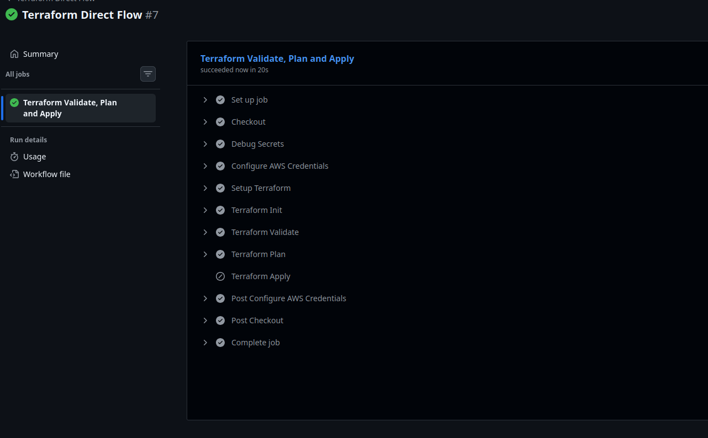

# 🚀 AWS Lambda & API Gateway com Terraform (IaC)

Este projeto demonstra a criação de uma arquitetura **Serverless** na AWS utilizando **Terraform**. A solução consiste em uma função Lambda escrita em Node.js que processa nomes recebidos via API Gateway.

---

## 🏗️ Arquitetura da Solução

A estrutura foi desenhada utilizando **Módulos**, garantindo que a infraestrutura seja escalável, organizada e reutilizável.

* **API Gateway:** Porta de entrada (REST API) que recebe requisições HTTP (POST/GET).
* **AWS Lambda:** Lógica de negócio que processa o nome e retorna uma mensagem personalizada.
* **IAM Roles:** Permissões de segurança para que os serviços se comuniquem.
* **CloudWatch:** Logs automáticos para monitoramento da execução.

---

## 📂 Estrutura de Pastas

```bash
Templates_Terraform/
├── main.tf                 # 🎛️ Orquestrador: Chama os módulos
├── variables.tf            # 📝 Variáveis globais da raiz
├── outputs.tf              # 📤 Outputs finais (URL da API)
├── functions/
│   └── index.mjs           # 📜 Código-fonte da Lambda (Node.js)
└── modules/
    ├── lambda/             # ⚡ Módulo de computação
    │   ├── main.tf
    │   ├── variables.tf
    │   └── outputs.tf
    └── api_gateway/        # 🌐 Módulo de rede/exposição
        ├── main.tf
        ├── variables.tf
        └── outputs.tf
```

---

## 🛠️ O Código da Função (`index.mjs`)

A função é capaz de identificar o nome enviado tanto por **URL Query Parameters** quanto pelo **Corpo da Requisição (JSON)**:

```javascript
export const handler = async (event) => {
  console.log("Evento recebido:", JSON.stringify(event, null, 2));

  let nome = "Visitante";

  try {
      // 1. Tenta pegar o nome via Query String (ex: api.com/test?nome=Junior)
      if (event.queryStringParameters && event.queryStringParameters.nome) {
          nome = event.queryStringParameters.nome;
      } 
      // 2. Tenta pegar o nome via Body (POST)
      else if (event.body) {
          const body = JSON.parse(event.body);
          nome = body.nome || nome;
      }
  } catch (error) {
      console.error("Erro ao processar input:", error);
  }

  const response = {
      statusCode: 200,
      headers: {
          "Content-Type": "application/json",
          "Access-Control-Allow-Origin": "*" // Importante para evitar erros de CORS
      },
      body: JSON.stringify({
          mensagem: `Olá, ${nome}! Função executada com sucesso.`,
          timestamp: new Date().toISOString()
      }),
  };

  return response;
};
```

---

## ⌨️ Comandos do Terraform

Siga estes passos no terminal para subir a infraestrutura:

| Comando | Descrição |
| :--- | :--- |
| `terraform init` | 📥 Inicializa os módulos e baixa o provider da AWS. |
| `terraform fmt -recursive` | 🎨 Formata o código para os padrões do Terraform. |
| `terraform validate` | 🔍 Verifica se a sintaxe do código está correta. |
| `terraform plan` | 📋 Mostra o que será criado/alterado antes de aplicar. |
| `terraform apply` | 🚀 Cria a infraestrutura na AWS (digite `yes`). |
| `terraform destroy` | 💣 Remove todos os recursos criados para evitar custos. |

---

## 🧪 Testando a API

Após rodar o `terraform apply`, você receberá a **URL de acesso**. Use os comandos abaixo para testar:

### 1️⃣ Teste via Navegador (GET)
Cole a URL no seu browser adicionando o nome ao final:
`https://sua-api.execute-api.us-east-1.amazonaws.com/dev/hello?nome=Erick`

### 2️⃣ Teste via Terminal (cURL - POST)
```bash
curl -X POST https://sua-api.execute-api.us-east-1.amazonaws.com/dev/hello \
     -H "Content-Type: application/json" \
     -d '{"nome": "Erick Fernandes"}'
```

---

## 💡 Dicas de Manutenção

* **Alterou o código JS?** Basta rodar `terraform apply` novamente. O Terraform detecta a mudança no arquivo, gera um novo `.zip` e atualiza a Lambda automaticamente. 🔄
* **CORS:** O código já inclui headers de `Access-Control-Allow-Origin` para facilitar testes via Frontend (React/Vue/HTML). 🌐
* **Logs:** Se algo der errado, verifique o **CloudWatch Logs** da sua Lambda no Console AWS. 🪵

---


Por fim, quando foe executado o comando git push vai executar um pipeline no github actions, para validar, testar e formartar o nosso template terraform.



**Desenvolvido com ❤️ e Terraform!** 🛠️✨